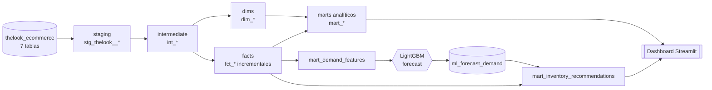
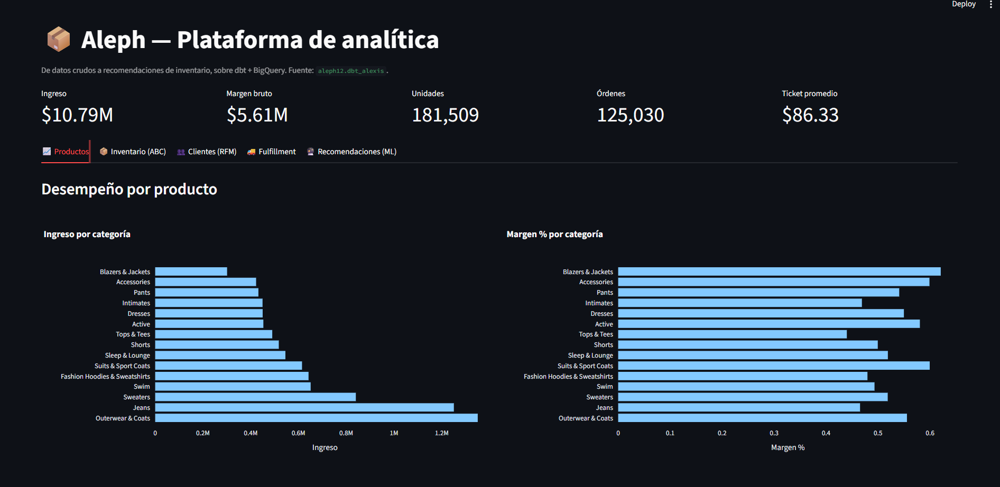
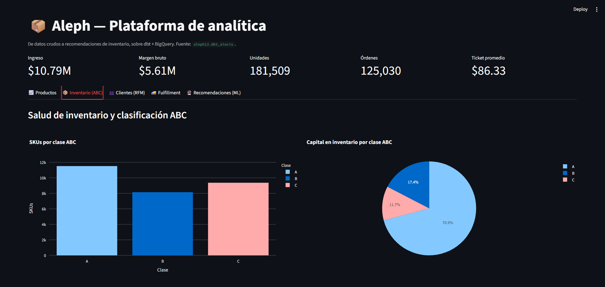
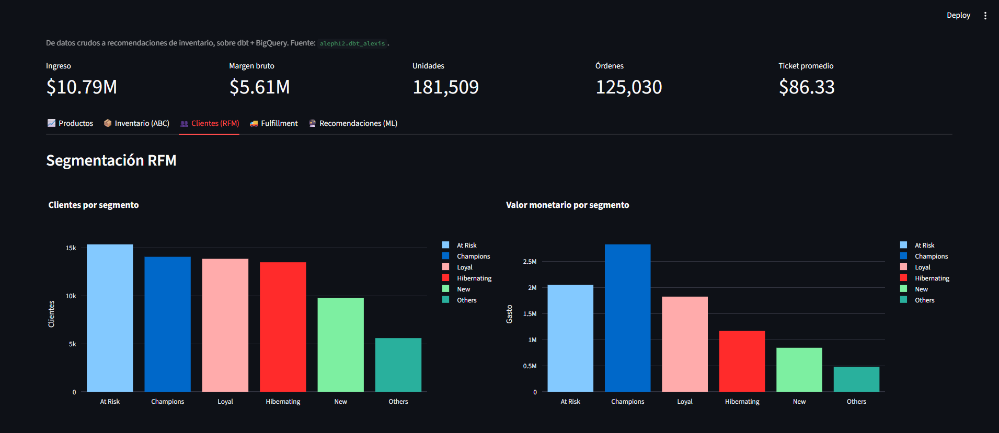
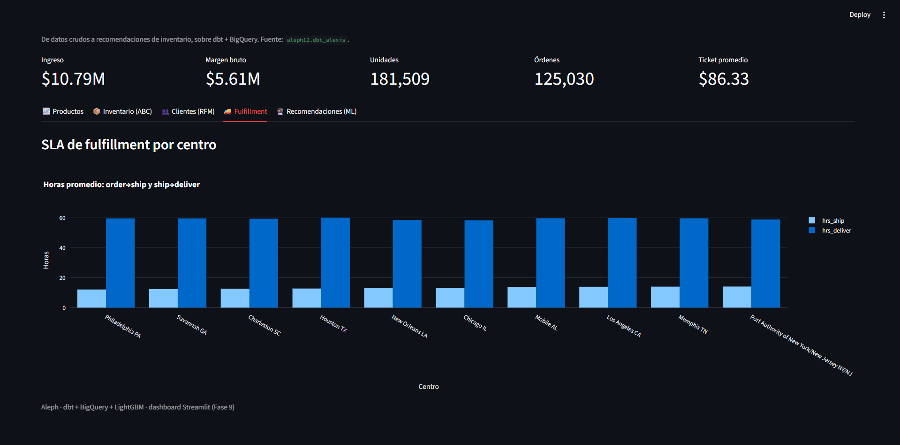
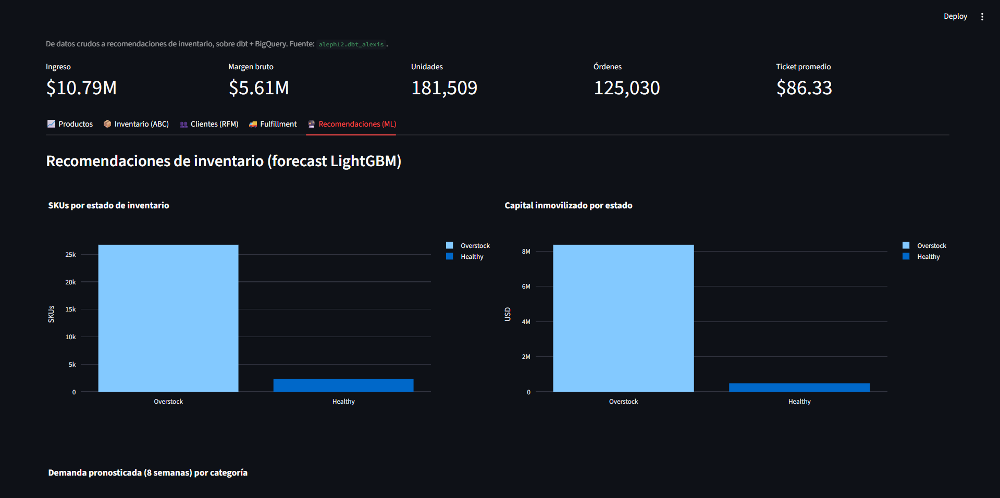

# Aleph

[](https://github.com/alexxcode/aleph/actions/workflows/ci_pr.yml)
[](https://github.com/alexxcode/aleph/actions/workflows/scheduled_prod.yml)

> *"El lugar donde están, sin confundirse, todos los lugares del orbe, vistos desde todos los ángulos."* — J. L. Borges

En ingeniería de datos, ese punto que lo contiene todo tiene un nombre más prosaico: **Single Source of Truth**. **Aleph** es una plataforma de analítica *end-to-end* para un distribuidor de e-commerce, construida sobre **dbt + BigQuery**, que va del dato crudo a una recomendación de inventario accionable — y cierra el círculo devolviendo un pronóstico de demanda (ML) al warehouse.

---

## Qué hace

Toma el esquema de un distribuidor real (el dataset público `bigquery-public-data.thelook_ecommerce`) y lo transporta por todas las capas de una plataforma analítica de producción:

```
sources → staging → intermediate → marts (dims · facts · analíticos) → capa ML → capa semántica → BI
```

El diferencial no es el dashboard final, sino el **loop completo**: la ingeniería analítica alimenta un modelo de forecasting (LightGBM), y ese pronóstico regresa como fuente a dbt para producir recomendaciones de reorden, stock de seguridad y alertas de quiebre.

---

## Narrativa: de raw a recomendación

1. **Sources + staging.** Las 7 tablas de thelook se referencian vía `source()` (con `freshness` sobre `orders`) y se limpian 1:1 en 7 vistas `stg_thelook__*` (renombrado, tipos, orden lógico; sin negocio).
2. **Núcleo dimensional.** Star schema Kimball: dimensiones (`dim_products`, `dim_customers`, `dim_distribution_centers`, `dim_dates`) y hechos incrementales particionados/clusterizados (`fct_order_items`, `fct_orders`, `fct_inventory_snapshot`).
3. **Snapshots SCD2.** `snap_products` versiona precio y costo; el margen se recalcula con el **costo vigente al momento de la venta**, no el actual — un detalle de analytics engineering que la mayoría omite.
4. **Calidad + contracts.** Tests genéricos, singulares y `dbt_expectations`; **contracts** forzados en los modelos críticos; docs y [grafo de linaje](docs/lineage.md).
5. **Marts analíticos.** Performance de producto, salud de inventario (ABC), RFM de clientes y SLA de fulfillment.
6. **Features + forecast ML.** `mart_demand_features` (categoría × semana) → **LightGBM** con validación temporal → `ml_forecast_demand` de vuelta a BigQuery → reingresa como `source` → `mart_inventory_recommendations`.
7. **Capa semántica.** Métricas gobernadas (`revenue`, `gross_margin`, `aov`, `units_sold`) con MetricFlow.
8. **Orquestación.** GitHub Actions con auth **keyless (WIF)**: dataset efímero por PR + Slim CI, y corrida diaria a `analytics`.
9. **BI.** Dashboard en **Streamlit** sobre los marts ([`bi/`](bi/)).

---

## Arquitectura



Grafo de linaje real generado desde el manifest: [`docs/lineage.md`](docs/lineage.md).

---

## Resultados y cifras

**Pipeline** (una sola fuente pública → plataforma completa):

| | |
|---|---|
| Modelos | 23 (7 staging · 2 intermedios · 4 dims · 3 facts · 6 marts analíticos · 1 time spine) |
| Tests de datos | 62 (unique/not_null, relationships, accepted_values, `dbt_expectations`, singulares) |
| Sources · snapshots · exposures · métricas | 9 · 1 · 2 · 5 |
| Volumen | `fct_inventory_snapshot` 11.0M filas · `fct_order_items` 181k · `dim_customers` 100k |

**Highlights de ingeniería:**

- **Incremental real:** la 2ª corrida de `fct_order_items` procesa **24.1 MiB → 413 KiB (~60× menos)** gracias a `insert_overwrite` con predicado sobre la partición.
- **Forecast de demanda:** LightGBM con validación temporal recursiva — **WAPE ≈ 0.11 a 1 semana**, ≈ 0.32 sobre 8 semanas.
- **Hallazgo de negocio:** el cruce forecast × inventario revela **~26.7k SKUs en overstock (~$8.4M de capital inmovilizado)** — thelook está estructuralmente sobre-stockeado; la acción no es reordenar sino liquidar/reducir.
- **Margen SCD2:** **18.180 líneas** de venta con margen histórico distinto al que daría el costo actual.
- **CI keyless:** Slim CI construye solo lo modificado (**~19 s** en el smoke test) en un dataset efímero que se destruye al final; auth por Workload Identity Federation (sin keyfiles).

---

## Dashboard

Dashboard interactivo en **Streamlit** sobre los marts ([`bi/`](bi/)) — KPIs de negocio y cinco vistas.



| Salud de inventario (ABC) | Segmentación de clientes (RFM) |
|---|---|
|  |  |

| SLA de fulfillment por centro | Recomendaciones de inventario (forecast ML) |
|---|---|
|  |  |

---

## Decisiones de arquitectura

- **Forecast a grano categoría × semana, no producto.** La demanda por SKU es tan dispersa (ningún producto supera ~24 ventas en 3 años) que a ese grano no hay señal; se pronostica por categoría y se **asigna a SKU por participación** (jerárquico top-down).
- **Costo al momento de la venta vía SCD2**, no el costo actual — margen histórico correcto.
- **`insert_overwrite` + partición** para incrementales baratos; la corrida diaria de prod usa `--full-refresh` porque la fuente pública se **regenera** y reasigna `order_id` a nuevas fechas.
- **Contracts** (tipos + `not_null`) en `dim_products` y `fct_order_items` como frontera estable hacia BI/ML.
- **WIF en vez de keyfiles** en CI: la política de seguridad del proyecto deshabilita llaves de service account, y WIF es además la práctica recomendada.

---

## Stack

| Capa | Herramienta |
|---|---|
| Warehouse | BigQuery (región `US`) |
| Transformación | dbt Core 1.11 + `dbt-bigquery` |
| Calidad | tests genéricos + singulares, `dbt_utils`, `dbt_expectations`, model contracts |
| Capa semántica | MetricFlow (semantic models + metrics) |
| ML | Python 3.12, LightGBM (validación temporal) |
| CI/CD | GitHub Actions · Workload Identity Federation · Slim CI |
| BI | Streamlit + Plotly |

---

## Estructura del repo

```
models/
├── staging/thelook/     # limpieza 1:1 con la fuente
├── intermediate/        # joins y enriquecimiento
├── marts/
│   ├── core/            # dimensiones y hechos (star schema)
│   └── analytics/       # marts de negocio + features ML
└── semantic/            # capa semántica (MetricFlow)
snapshots/               # SCD2 (historial precio/costo)
ml/                      # forecast de demanda (LightGBM)
bi/                      # dashboard Streamlit
tests/                   # tests singulares
docs/                    # linaje + guía de CI
.github/workflows/       # CI de PR + corrida programada
```

---

## Roadmap

- [x] **Fase 0 — Fundaciones.** Proyecto GCP, dbt + BigQuery, repo, materializaciones por capa.
- [x] **Fase 1 — Sources + staging.** Las 7 tablas como `source` con freshness; los 7 modelos de staging.
- [x] **Fase 2 — Núcleo dimensional.** Dims + facts incrementales, partición/cluster, relationships.
- [x] **Fase 3 — Snapshots SCD2.** Historial de precio/costo y margen histórico correcto.
- [x] **Fase 4 — Calidad + documentación.** `dbt_expectations`, tests singulares, contracts, exposures, [grafo de linaje](docs/lineage.md).
- [x] **Fase 5 — Marts analíticos.** Performance de producto, salud de inventario (ABC), RFM, SLA de fulfillment.
- [x] **Fase 6 — Features + forecast ML.** Features de demanda (categoría×semana), LightGBM con validación temporal, forecast de vuelta a BQ, recomendaciones de inventario.
- [x] **Fase 7 — Capa semántica.** Métricas (revenue, gross_margin, aov, units_sold) con MetricFlow.
- [x] **Fase 8 — Orquestación + CI/CD.** Actions (dataset efímero por PR + teardown), Slim CI (`state:modified+ --defer`), corrida diaria a `analytics`. Ver [setup](docs/ci-setup.md).
- [x] **Fase 9 — BI + writeup.** Dashboard [Streamlit](bi/) sobre los marts y narrativa raw → recomendación.

---

## Cómo correrlo

```powershell
# 1. Entorno
python -m venv .venv
.\.venv\Scripts\Activate.ps1
pip install -r requirements.txt

# 2. Autenticación (OAuth / Application Default Credentials)
gcloud auth application-default login

# 3. Verificar conexión y construir
dbt debug
dbt build

# 4. (opcional) Forecast de demanda
pip install -r ml/requirements.txt
python ml/train_forecast.py

# 5. (opcional) Dashboard
pip install -r bi/requirements.txt
streamlit run bi/app.py
```

> El `profiles.yml` vive en `~/.dbt/` y **nunca** se versiona. El repo no contiene credenciales. La configuración de CI/CD está en [docs/ci-setup.md](docs/ci-setup.md).
