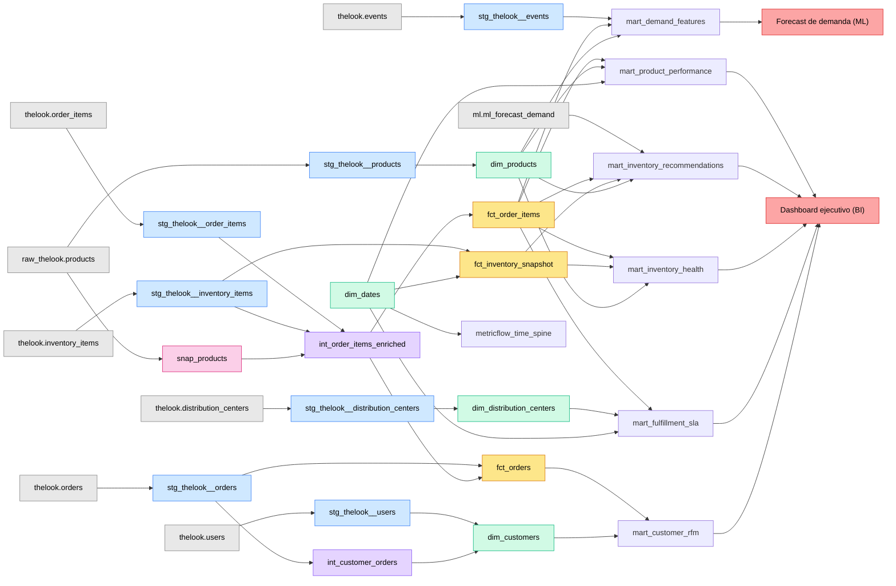

# Grafo de linaje

Generado desde `target/manifest.json` (`dbt docs generate`). Capa: fuente → staging → intermediate → dims/facts → snapshot → exposures.

```mermaid
flowchart LR
    dim_customers["dim_customers"]:::dim
    dim_dates["dim_dates"]:::dim
    dim_distribution_centers["dim_distribution_centers"]:::dim
    dim_products["dim_products"]:::dim
    exp_demand_forecast["Forecast de demanda (ML)"]:::exposure
    exp_executive_dashboard["Dashboard ejecutivo (BI)"]:::exposure
    fct_inventory_snapshot["fct_inventory_snapshot"]:::fct
    fct_order_items["fct_order_items"]:::fct
    fct_orders["fct_orders"]:::fct
    int_customer_orders["int_customer_orders"]:::intermediate
    int_order_items_enriched["int_order_items_enriched"]:::intermediate
    mart_customer_rfm["mart_customer_rfm"]:::model
    mart_demand_features["mart_demand_features"]:::model
    mart_fulfillment_sla["mart_fulfillment_sla"]:::model
    mart_inventory_health["mart_inventory_health"]:::model
    mart_inventory_recommendations["mart_inventory_recommendations"]:::model
    mart_product_performance["mart_product_performance"]:::model
    metricflow_time_spine["metricflow_time_spine"]:::model
    snap_products["snap_products"]:::snap
    src_distribution_centers["thelook.distribution_centers"]:::source
    src_events["thelook.events"]:::source
    src_inventory_items["thelook.inventory_items"]:::source
    src_ml_forecast_demand["ml.ml_forecast_demand"]:::source
    src_order_items["thelook.order_items"]:::source
    src_orders["thelook.orders"]:::source
    src_products["raw_thelook.products"]:::source
    src_users["thelook.users"]:::source
    stg_thelook__distribution_centers["stg_thelook__distribution_centers"]:::staging
    stg_thelook__events["stg_thelook__events"]:::staging
    stg_thelook__inventory_items["stg_thelook__inventory_items"]:::staging
    stg_thelook__order_items["stg_thelook__order_items"]:::staging
    stg_thelook__orders["stg_thelook__orders"]:::staging
    stg_thelook__products["stg_thelook__products"]:::staging
    stg_thelook__users["stg_thelook__users"]:::staging

    dim_customers --> mart_customer_rfm
    dim_dates --> fct_inventory_snapshot
    dim_dates --> mart_fulfillment_sla
    dim_dates --> mart_product_performance
    dim_dates --> metricflow_time_spine
    dim_distribution_centers --> mart_fulfillment_sla
    dim_products --> mart_demand_features
    dim_products --> mart_inventory_health
    dim_products --> mart_inventory_recommendations
    dim_products --> mart_product_performance
    fct_inventory_snapshot --> mart_inventory_health
    fct_inventory_snapshot --> mart_inventory_recommendations
    fct_order_items --> mart_demand_features
    fct_order_items --> mart_fulfillment_sla
    fct_order_items --> mart_inventory_health
    fct_order_items --> mart_inventory_recommendations
    fct_order_items --> mart_product_performance
    fct_orders --> mart_customer_rfm
    int_customer_orders --> dim_customers
    int_order_items_enriched --> fct_order_items
    int_order_items_enriched --> fct_orders
    mart_customer_rfm --> exp_executive_dashboard
    mart_demand_features --> exp_demand_forecast
    mart_fulfillment_sla --> exp_executive_dashboard
    mart_inventory_health --> exp_executive_dashboard
    mart_inventory_recommendations --> exp_executive_dashboard
    mart_product_performance --> exp_executive_dashboard
    snap_products --> int_order_items_enriched
    src_distribution_centers --> stg_thelook__distribution_centers
    src_events --> stg_thelook__events
    src_inventory_items --> stg_thelook__inventory_items
    src_ml_forecast_demand --> mart_inventory_recommendations
    src_order_items --> stg_thelook__order_items
    src_orders --> stg_thelook__orders
    src_products --> snap_products
    src_products --> stg_thelook__products
    src_users --> stg_thelook__users
    stg_thelook__distribution_centers --> dim_distribution_centers
    stg_thelook__events --> mart_demand_features
    stg_thelook__inventory_items --> fct_inventory_snapshot
    stg_thelook__inventory_items --> int_order_items_enriched
    stg_thelook__order_items --> int_order_items_enriched
    stg_thelook__orders --> fct_orders
    stg_thelook__orders --> int_customer_orders
    stg_thelook__products --> dim_products
    stg_thelook__users --> dim_customers

    classDef source fill:#e8e8e8,stroke:#888,color:#000;
    classDef staging fill:#cfe8ff,stroke:#3b82f6,color:#000;
    classDef intermediate fill:#e5d4ff,stroke:#8b5cf6,color:#000;
    classDef dim fill:#d1fae5,stroke:#10b981,color:#000;
    classDef fct fill:#fde68a,stroke:#d97706,color:#000;
    classDef snap fill:#fbcfe8,stroke:#db2777,color:#000;
    classDef exposure fill:#fca5a5,stroke:#dc2626,color:#000;
```
